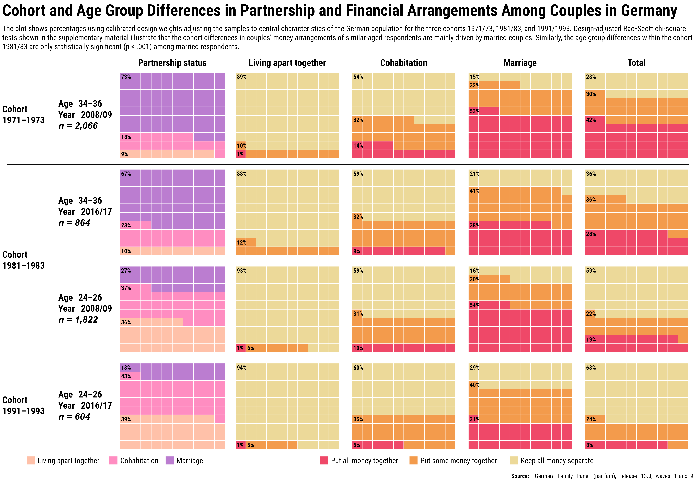

# Couples’ money arrangements in Germany: A visualization of cohort, age group, and partnership type variations

### [Marcel Raab](https://marcelraab.de/) & [Florian Schulz](https://flociologist.github.io/)

This repository contains the code files required to reproduce the
figures and tables in our data visualization paper published in
[Socius](https://journals.sagepub.com/home/SRD). A html version of the
article supplement can be found
[here](https://maraab23.github.io/CoupleMoney/).

## Instructions for replication

The code is organized within the structure of an RStudio Project and
works best when you work with RStudio and by opening the corresponding
.Rproj file (`CoupleMoney.Rproj`) either within RStudio or by
double-clicking on it. Of course, the code will also work if you do not
use RStudio. Then, however, you have to ensure that your starting
working directory is the root folder of this project (i.e., the folder
that contains the R scripts and the .Rproj file). We used RStudio
(2024.04.2 Build 764) with R version 4.4.0.

The visualization, supplementary tables, and figure are based on data
from the <a href="https://doi.org/10.4232/pairfam.5678.13.0.0"
target="_blank">German Family Panel (pairfam), release 13.0</a>. The
data is available for scientific purposes from GESIS Leibniz Institute
for the Social Sciences. For this project, we only use two files ,
`anchor1.dta` and `anchor9.dta`, stored in Stata’s .dta format.

To replicate our analysis, you need to download these files to the
folder `/data/pairfam` and run the R scripts in the intended order:

- `01_data.R`: imports the original pairfam files and prepares them for
  producing plots and tables
- `02_plot.R`: produces the visualization shown in the paper
- `03_plot_annotated.R`: produces the visualization shown in the paper
  with some additional annotations (see figure shown below)
- `04_plot_parental.R`: produces the plot shown in the Supplement
- `05_tables.R`: produces the tables shown in the Supplement

The [supplement website](https://maraab23.github.io/CoupleMoney/) can be
reproduced by rendering `Supplement.qmd`.This file draws on data,
tables, and figures generated by the five R scripts, so make sure to run
them first before rendering `Supplement.qmd`. In addition, the .qmd file
uses a screenshot from the pairfam questionnaire (`/images/Q-248.png`),
a BibTeX bibliography (`references.bib`) a Citation Style Language file
(`asa.csl`), and theme scss file (`custom.scss`).

## The plot

